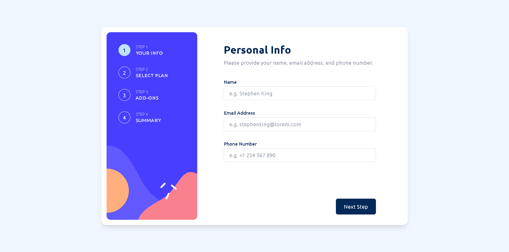

# Frontend Mentor - Multi-step form solution

This is a solution to the [Multi-step form challenge on Frontend Mentor](https://www.frontendmentor.io/challenges/multistep-form-YVAnSdqQBJ). Frontend Mentor challenges help you improve your coding skills by building realistic projects.

## Table of contents

- [Overview](#overview)
  - [The challenge](#the-challenge)
  - [Screenshot](#screenshot)
  - [Links](#links)
- [My process](#my-process)
  - [Built with](#built-with)
  - [What I learned](#what-i-learned)
  - [Continued development](#continued-development)
  - [Useful resources](#useful-resources)
- [Author](#author)

## Overview

### The challenge

Users should be able to:

- Complete each step of the sequence
- Go back to a previous step to update their selections
- See a summary of their selections on the final step and confirm their order
- View the optimal layout for the interface depending on their device's screen size
- See hover and focus states for all interactive elements on the page
- Receive form validation messages if:
  - A field has been missed
  - The email address is not formatted correctly
  - A step is submitted, but no selection has been made

### Screenshot

### Links

- Solution URL: [https://www.frontendmentor.io/solutions/multistep-form-built-with-react-tailwind-css-and-redux-fNrzPzPnRS](https://www.frontendmentor.io/solutions/multistep-form-built-with-react-tailwind-css-and-redux-fNrzPzPnRS)
- Live Site URL: [https://multi-step-form-fr.netlify.app/](https://multi-step-form-fr.netlify.app/)

## My process

### Built with

- Mobile-first workflow
- [Tailwind CSS](tailwindcss.com) - Utility-first CSS Framework
- [React](https://reactjs.org/) - JS library
- [React Redux](https://react-redux.js.org/tutorials/quick-start) - JS Library for state management

### What I learned

- Learned React Redux basics and used it in this project for managing states. Overall, it is easy to understand but it has added boilerplate to start with. It is a great library for managing global states used throughout the whole app and a good alternative to context and reducer hook of react.

### Continued development

- Master React and know other useful libraries to be used in React.
- Learn Next.js for added knowledge and experience.
- Folder structuring in React.
- Try to add some animations with these project to look more interactive.

### Useful resources

- [React Redux](https://react-redux.js.org/tutorials/quick-start) - A library for managing states throughout your application. This is a documentation to get you started using it with React.

## Author

- Frontend Mentor - [@Lemon1903](https://www.frontendmentor.io/profile/Lemon1903)
