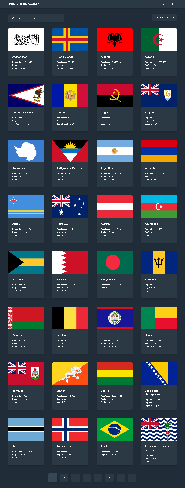

# Frontend Mentor - REST Countries API with color theme switcher solution

This is a solution to the [REST Countries API with color theme switcher challenge on Frontend Mentor](https://www.frontendmentor.io/challenges/rest-countries-api-with-color-theme-switcher-5cacc469fec04111f7b848ca). Frontend Mentor challenges help you improve your coding skills by building realistic projects.

## Table of contents

- [Overview](#overview)
  - [The challenge](#the-challenge)
  - [Screenshot](#screenshot)
  - [Links](#links)
- [My process](#my-process)
  - [Built with](#built-with)
  - [What I learned](#what-i-learned)
  - [Continued development](#continued-development)
- [Author](#author)

## Overview

### The challenge

Users should be able to:

- See all countries from the API on the homepage
- Search for a country using an `input` field
- Filter countries by region
- Click on a country to see more detailed information on a separate page
- Click through to the border countries on the detail page
- Toggle the color scheme between light and dark mode _(optional)_

### Screenshot

### Links

- Solution URL: [Add solution URL here](https://your-solution-url.com)
- Live Site URL: [Add live site URL here](https://your-live-site-url.com)

## My process

### Built with

- HTML
- CSS custom properties
- Tailwind CSS
- SWR - for fetching data
- Framer - Animation Library
- [React](https://reactjs.org/) - JS library

### What I learned

I learned the following:

- Making a pagination in React
- Making a skeleton preview of the data when fetching
- Usage of `useMemo` hook and also polished making custom hooks

### Continued development

In filtering the countries using search, I need to add a delay between each keystrokes since it is expensive and time consuming to filter a large data quickly since users can type fast. Due to this, the filtering of countries contains problems for the user experience (e.g. countries getting stucked in their place) and this issue needs to be solved.

## Author

- Frontend Mentor - [@Lemon1903](https://www.frontendmentor.io/profile/Lemon1903)
