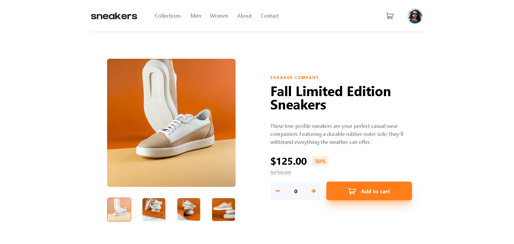

# Frontend Mentor - E-commerce product page solution

This is a solution to the [E-commerce product page challenge on Frontend Mentor](https://www.frontendmentor.io/challenges/ecommerce-product-page-UPsZ9MJp6). Frontend Mentor challenges help you improve your coding skills by building realistic projects.

## Table of contents

- [Overview](#overview)
  - [The challenge](#the-challenge)
  - [Screenshot](#screenshot)
  - [Links](#links)
- [My process](#my-process)
  - [Built with](#built-with)
  - [What I learned](#what-i-learned)
  - [Continued development](#continued-development)
  - [Useful resources](#useful-resources)
- [Author](#author)

## Overview

### The challenge

Users should be able to:

- View the optimal layout for the site depending on their device's screen size
- See hover states for all interactive elements on the page
- Open a lightbox gallery by clicking on the large product image
- Switch the large product image by clicking on the small thumbnail images
- Add items to the cart
- View the cart and remove items from it

### Screenshot

### Links

- Solution URL: [Add solution URL here](https://your-solution-url.com)
- Live Site URL: [Add live site URL here](https://your-live-site-url.com)

## My process

### Built with

- Semantic HTML
- Tailwind CSS, PostCSS, autoprefixer
- Mobile-first workflow
- [React](https://reactjs.org/) - JS library

### What I learned

- I learned a lot and to summarize, I learned React and Tailwind in which I use them with this challenge. It was fun learning and applying those in this challenge.
- Main concepts learned in React was components, props, managing states with `useReducer` and `useState`, using context API, and more!
- Managed to used Tailwind which made the designing a lot faster and easier with the utilities.

### Continued development

- More practice with React concepts and master them.
- Maybe learn Next.js too for full-stack or even just the frontend. It can be a huge asset to be in my toolbelt.
- Maybe I can continue my Django journey and connect it with these frameworks

### Useful resources

- [React](https://react.dev/) - It contains eveything you need to know in React. It also have a well written documentation.
- [Tailwind CSS](https://tailwindcss.com/) - It contains eveything you need to know in tailwind.

## Author

- Frontend Mentor - [@Lemon1903](https://www.frontendmentor.io/profile/Lemon1903)
