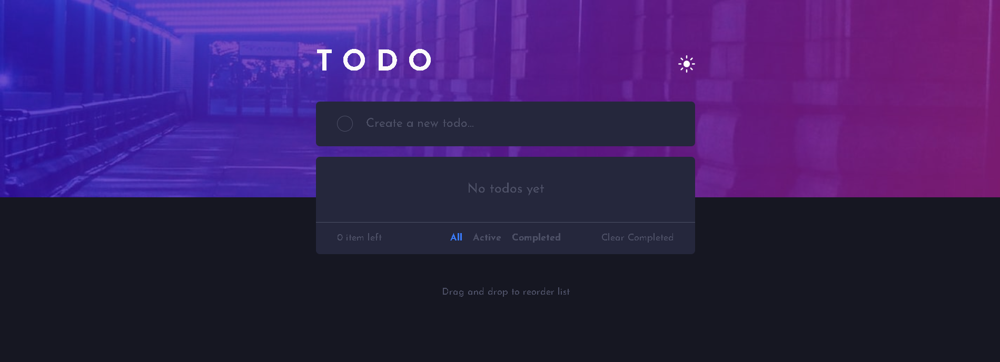
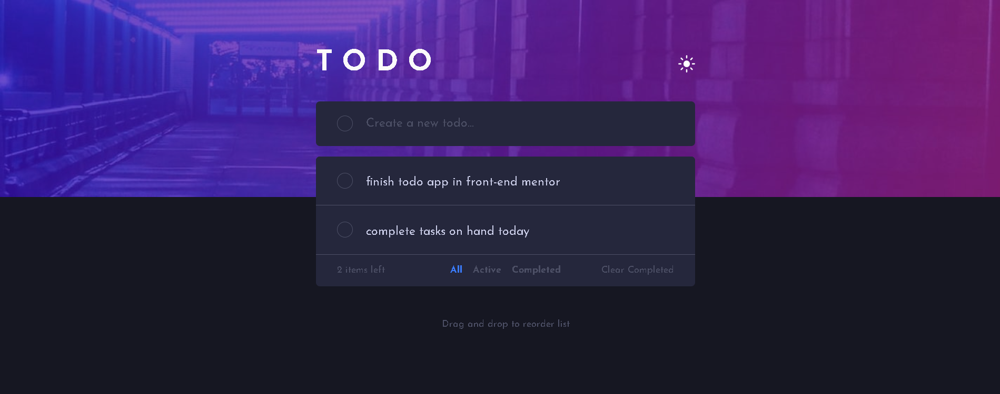
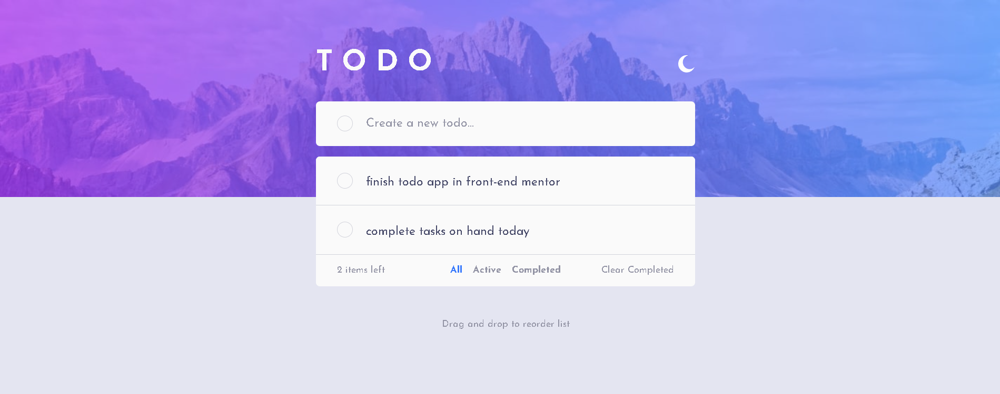

# Frontend Mentor - Todo app solution

This is a solution to the [Todo app challenge on Frontend Mentor](https://www.frontendmentor.io/challenges/todo-app-Su1_KokOW). Frontend Mentor challenges help you improve your coding skills by building realistic projects.

## Table of contents

- [Overview](#overview)
  - [The challenge](#the-challenge)
  - [Screenshot](#screenshot)
  - [Links](#links)
- [My process](#my-process)
  - [Built with](#built-with)
  - [What I learned](#what-i-learned)
  - [Continued development](#continued-development)
  - [Useful resources](#useful-resources)
- [Author](#author)

## Overview

### The challenge

Users should be able to:

- View the optimal layout for the app depending on their device's screen size
- See hover states for all interactive elements on the page
- Add new todos to the list
- Mark todos as complete
- Delete todos from the list
- Filter by all/active/complete todos
- Clear all completed todos
- Toggle light and dark mode
- **Bonus**: Drag and drop to reorder items on the list

### Screenshot

Without items

With items

Light mode

### Links

- Solution URL: [https://www.frontendmentor.io/solutions/todoapp-build-with-react-tailwind-css-and-framermotion-ZCWS92iOsL](https://www.frontendmentor.io/solutions/todoapp-build-with-react-tailwind-css-and-framermotion-ZCWS92iOsL)
- Live Site URL: [https://lemon-todo-app.netlify.app/](https://lemon-todo-app.netlify.app/)

## My process

### Built with

- Semantic HTML
- Mobile-first workflow
- [React](https://react.dev/) - JS library
- [Tailwind CSS](https://tailwindcss.com/) - Utility-first CSS Framework
- [Framer-Motion](https://www.framer.com/motion/) - A production-ready motion library for React

### What I learned

- Basics of framer-motion to get started in using it in this app which is a great library for creating amazing animations easily. I used it mainly on:
  - reordering todo items
  - removing and adding todo items
  - animating the empty message base on the number of todo items
- Drag and drop API in HTML and JavaScript but wasn't able to do it here due to using framer-motion.

### Continued development

- Learn more about framer-motion and how to create more basic animations with it.
- Hone folder structuring in React and also when to actually separate a JSX code into a component.
- Hone knowledge regarding using Context API for state management.

### Useful resources

- [HTML Drag and Drop API](https://developer.mozilla.org/en-US/docs/Web/API/HTML_Drag_and_Drop_API) - Everything to know about drag and drop for websites.
- [Drag and Reorder effect](https://www.framer.com/motion/reorder/) - animation for reordering items in a list or layout.
- [Idea for using darkmode in Tailwind](https://github.com/fireship-io/tailwind-dashboard) - Shows how to use darkmode in Tailwind CSS.

## Author

- Frontend Mentor - [@Lemon1903](https://www.frontendmentor.io/profile/Lemon1903)
