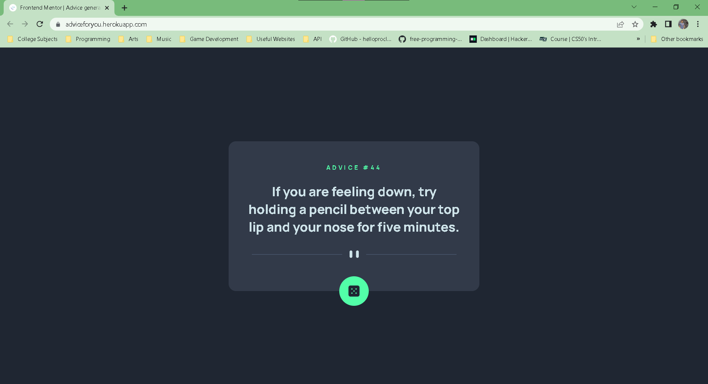

# Frontend Mentor - Advice generator app solution

This is a solution to the [Advice generator app challenge on Frontend Mentor](https://www.frontendmentor.io/challenges/advice-generator-app-QdUG-13db). Frontend Mentor challenges help you improve your coding skills by building realistic projects.

## Table of contents

- [Overview](#overview)
  - [The challenge](#the-challenge)
  - [Screenshot](#screenshot)
  - [Links](#links)
- [My process](#my-process)
  - [Built with](#built-with)
  - [What I learned](#what-i-learned)
  - [Continued development](#continued-development)
  - [Useful resources](#useful-resources)
- [Author](#author)

## Overview

### The challenge

Users should be able to:

- View the optimal layout for the app depending on their device's screen size
- See hover states for all interactive elements on the page
- Generate a new piece of advice by clicking the dice icon

### Screenshot



### Links

- Solution URL: [https://www.frontendmentor.io/solutions/advice-generator-app-built-using-django-iqJ1mRx1RN](https://www.frontendmentor.io/solutions/advice-generator-app-built-using-django-iqJ1mRx1RN)
- Live Site URL: [https://adviceforyou.herokuapp.com/](https://adviceforyou.herokuapp.com/)

## My process

### Built with

- Semantic HTML
- CSS custom properties
- CSS Flexbox
- [Django](https://docs.djangoproject.com/en/4.1/) - Django Web Framework

### What I learned

- Hosting a server for my Django App using Heroku.
- I learned to make a synchronous request to an API using request module in python.

```python
def generate_random_advice(request):
    response = requests.get("https://api.adviceslip.com/advice").json()
    context = {
        "advice_id": response["slip"]["id"],
        "advice": response["slip"]["advice"],
    }
    return render(request, "advice/index.html", context)
```

### Continued development

- Need to learn more making API request synchronously and asynchronously in Python.
- Learn making API request in Javascript together with DOM manipulation.

### Useful resources

- [Hosting Django App with Heroku](https://studygyaan.com/django/django-everywhere-host-your-django-app-for-free-on-heroku) - This guide helps to know the requirements needed to be done to host a django app in heroku for free.
- [How to display an API request in Python](https://studygyaan.com/django/how-to-display-api-response-in-html-using-django-template) - This helps me know how to make an API request in Python.

## Author

- Frontend Mentor - [@Lemon1903](https://www.frontendmentor.io/profile/Lemon1903)
