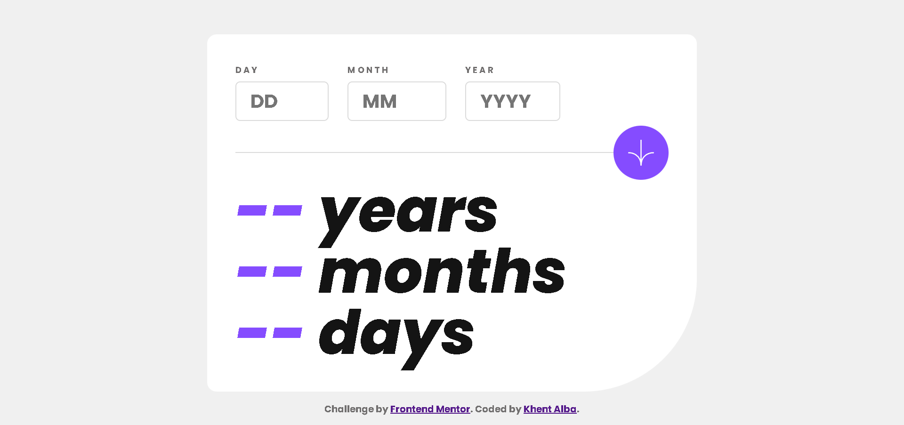

# Frontend Mentor - Age calculator app solution

This is a solution to the [Age calculator app challenge on Frontend Mentor](https://www.frontendmentor.io/challenges/age-calculator-app-dF9DFFpj-Q). Frontend Mentor challenges help you improve your coding skills by building realistic projects.

## Table of contents

- [Overview](#overview)
  - [The challenge](#the-challenge)
  - [Screenshot](#screenshot)
  - [Links](#links)
- [My process](#my-process)
  - [Built with](#built-with)
  - [What I learned](#what-i-learned)
  - [Continued development](#continued-development)
- [Author](#author)

## Overview

### The challenge

Users should be able to:

- View an age in years, months, and days after submitting a valid date through the form
- Receive validation errors if:
  - Any field is empty when the form is submitted
  - The day number is not between 1-31
  - The month number is not between 1-12
  - The year is in the future
  - The date is invalid e.g. 31/04/1991 (there are 30 days in April)
- View the optimal layout for the interface depending on their device's screen size
- See hover and focus states for all interactive elements on the page
- **Bonus**: See the age numbers animate to their final number when the form is submitted

### Screenshot



### Links

- Solution URL: [https://www.frontendmentor.io/solutions/age-calculator-app-using-vanilla-css-and-javascript-nwQb2jLnnk](https://www.frontendmentor.io/solutions/age-calculator-app-using-vanilla-css-and-javascript-nwQb2jLnnk)
- Live Site URL: [https://lemon1903.github.io/Age-Calculator-App/](https://lemon1903.github.io/Age-Calculator-App/)

## My process

### Built with

- Semantic HTML5 markup
- CSS custom properties
- CSS sFlexbox and Grid

### What I learned

- I get more comfortable using CSS properties and property inheritance.
- Get more comfortable with the Javascript language for coding solution to problems such as error validation.
- Felt proud thinking of using grid as a solution for the input and button layout.

```css
.form-group {
  ...
  grid-template-columns: 3fr 1fr;
}

.birth-inputs {
  ...
  grid-area: 1 / 1 / 2 / 2;
  ...
}

.divider {
  align-self: center;
  grid-area: 2 / 1 / 3 / -1;
}

.calculate-button {
  justify-self: end;
  grid-area: 2 / 2 / 3 / -1;
  ...
}
```

### Continued development

- Be more comfortable at guessing the right amount for every properties and also think of a solution fast to those challenging layouts.
- Deep dive on CSS preprocessor or advance CSS.
- Learn some animations for cool effects _(such as using animation for the numbers starting from 0 up to the calculated answer)_.

## Author

- Frontend Mentor - [@Lemon1903](https://www.frontendmentor.io/profile/Lemon1903)
