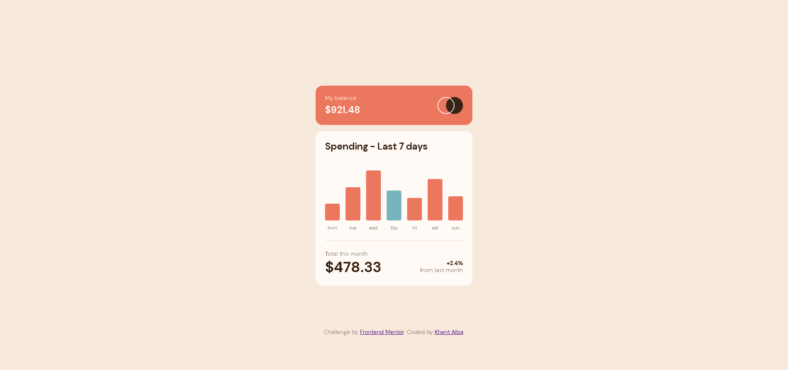

# Frontend Mentor - Expenses chart component solution

This is a solution to the [Expenses chart component challenge on Frontend Mentor](https://www.frontendmentor.io/challenges/expenses-chart-component-e7yJBUdjwt). Frontend Mentor challenges help you improve your coding skills by building realistic projects.

## Table of contents

- [Overview](#overview)
  - [The challenge](#the-challenge)
  - [Screenshot](#screenshot)
  - [Links](#links)
- [My process](#my-process)
  - [Built with](#built-with)
  - [What I learned](#what-i-learned)
  - [Useful resources](#useful-resources)
- [Author](#author)

## Overview

### The challenge

Users should be able to:

- View the bar chart and hover over the individual bars to see the correct amounts for each day
- See the current day’s bar highlighted in a different colour to the other bars
- View the optimal layout for the content depending on their device’s screen size
- See hover states for all interactive elements on the page
- **Bonus**: Use the JSON data file provided to dynamically size the bars on the chart

### Screenshot



### Links

- Solution URL: [Add solution URL here](https://your-solution-url.com)
- Live Site URL: [Add live site URL here](https://your-live-site-url.com)

## My process

### Built with

- Semantic HTML5 markup
- CSS custom properties
- CSS Flexbox and Grid
- Vanilla Javascript
- Mobile-first workflow

### What I learned

- Gained a better understanding to the usage of `:after` and `:before` pseudo-elements in CSS. In this example, I used it for the bar in the graph.

```css
.graph-bar:after {
  content: "";
  width: 1.5rem;
  height: 0;
  margin-bottom: 1em;
  border-radius: 3px;
  background-color: var(--bar-color);
  transition: height 0.5s ease-out, background-color 0.2s;
}
```

- Learned some manipulation of CSS styles in Javascript DOM.

```javascript
styleSheet.insertRule(`#${item.day}:after { height: ${barHeight}% }`, 1);
```

### Useful resources

- [MDN Web Docs](https://developer.mozilla.org/en-US/) - Well written web documentation for easy lookups and readings.
- [Animista](https://animista.net/) - Useful good CSS animations.
- [Making Charts with CSS](https://css-tricks.com/making-charts-with-css/) - Helped me gain idea on how to make a graph in CSS.
- [Selecting and manipulating `:after` and `:before` pseudo-elements in Javascript](https://stackoverflow.com/questions/5041494/selecting-and-manipulating-css-pseudo-elements-such-as-before-and-after-usin)

## Author

- Frontend Mentor - [@Lemon1903](https://www.frontendmentor.io/profile/Lemon1903)
