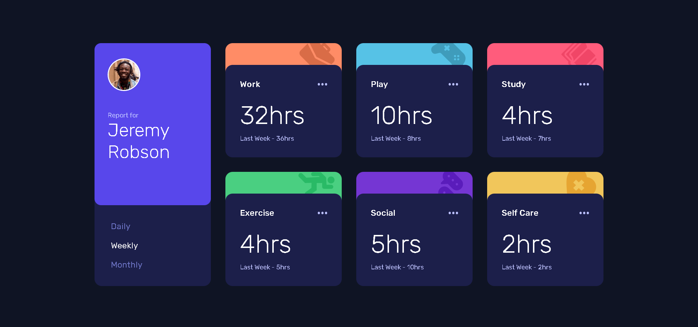

# Frontend Mentor - Time tracking dashboard solution

This is a solution to the [Time tracking dashboard challenge on Frontend Mentor](https://www.frontendmentor.io/challenges/time-tracking-dashboard-UIQ7167Jw). Frontend Mentor challenges help you improve your coding skills by building realistic projects.

## Table of contents

- [Overview](#overview)
  - [The challenge](#the-challenge)
  - [Screenshot](#screenshot)
  - [Links](#links)
- [My process](#my-process)
  - [Built with](#built-with)
  - [What I learned](#what-i-learned)
  - [Continued development](#continued-development)
  - [Useful resources](#useful-resources)
- [Author](#author)
- [Acknowledgments](#acknowledgments)

**Note: Delete this note and update the table of contents based on what sections you keep.**

## Overview

### The challenge

Users should be able to:

- View the optimal layout for the site depending on their device's screen size
- See hover states for all interactive elements on the page
- Switch between viewing Daily, Weekly, and Monthly stats

### Screenshot



### Links

- Solution URL: [Add solution URL here](https://your-solution-url.com)
- Live Site URL: [Add live site URL here](https://your-live-site-url.com)

## My process

### Built with

- Semantic HTML5 markup
- Vanilla CSS
- Vanilla Javascript
- Mobile-first workflow

### What I learned

- I learned vanilla Javascript and more on DOM manipulation in order to achieve dynamic content. Mainly this one!

```Javascript
for (let i = 0; i < periodOptions.children.length; i++) {
  const periodButton = periodOptions.children.item(i);
  periodButton.onclick = () => {
    if (previousPeriod == periodButton) return;
    resetAnimation();
    fetch("./data.json")
      .then((response) => response.json())
      .then((data) => {
        changeTimeValues(data, periodButton.textContent.toLowerCase());
        changeState(periodButton);
      });
  };
}
```

### Continued development

- Understand more advanced Javascript concepts like Promises, Closures, and Prototypes.
- Learn more DOM manipulation through Javascript.
- Learn React front-end framework, some CSS preprocessors and advanced CSS.

### Useful resources

- [Javascript Documentation](https://developer.mozilla.org/en-US/docs/Web/JavaScript) - Known Javascript documentation.
- [DOM Documentation](https://developer.mozilla.org/en-US/docs/Web/API/Document_Object_Model) - Known DOM documentation.

## Author

- Frontend Mentor - [@Lemon1903](https://www.frontendmentor.io/profile/Lemon1903)

## Acknowledgments

FreeCodeCamp helped me learned Javascript from beginner.
