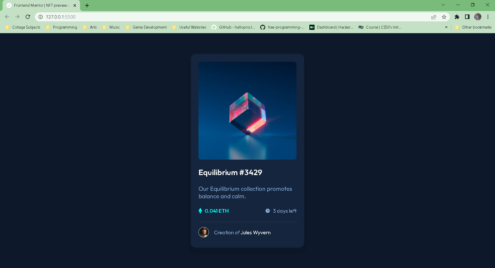
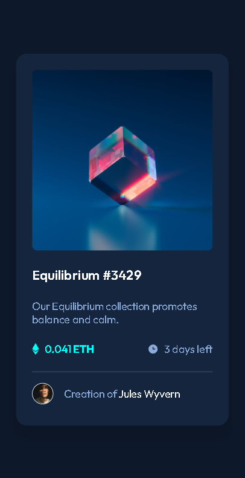

# Frontend Mentor - NFT preview card component solution

This is a solution to the [NFT preview card component challenge on Frontend Mentor](https://www.frontendmentor.io/challenges/nft-preview-card-component-SbdUL_w0U). Frontend Mentor challenges help you improve your coding skills by building realistic projects.

## Table of contents

- [Overview](#overview)
  - [The challenge](#the-challenge)
  - [Screenshot](#screenshot)
  - [Links](#links)
- [My process](#my-process)
  - [Built with](#built-with)
  - [What I learned](#what-i-learned)
  - [Continued development](#continued-development)
- [Author](#author)

## Overview

### The challenge

Users should be able to:

- View the optimal layout depending on their device's screen size
- See hover states for interactive elements

### Screenshot




### Links

- Solution URL: [https://www.frontendmentor.io/solutions/nft-preview-card-solution-using-css-flexbox-tF_vORf1_k](https://www.frontendmentor.io/solutions/nft-preview-card-solution-using-css-flexbox-tF_vORf1_k)
- Live Site URL: [https://lemon1903.github.io/NFT-Preview-Card-Component-Solution/](https://lemon1903.github.io/NFT-Preview-Card-Component-Solution/)

## My process

### Built with

- Semantic HTML5
- CSS custom properties
- CSS Flexbox and Grid

### What I learned

- Got more comfortable on using utility classes, custom properties, and flexbox and grid layouts.
- I learned a little bit about positiong for the image overlay.

```css
.image-container {
  position: relative;
}

.img-overlay {
  justify-content: center;
  position: absolute;
  top: 0;
  width: 100%;
  height: 100%;
  ...;
}
```

### Continued development

- Need to know more on responsiveness and get comfortable with it.
- Need to learn position more and get comfortable with it.
- Need to know more on handling images and svgs.
- Not rely too much on magic numbers for sizes.

## Author

- Frontend Mentor - [@Lemon1903](https://www.frontendmentor.io/profile/Lemon1903)
