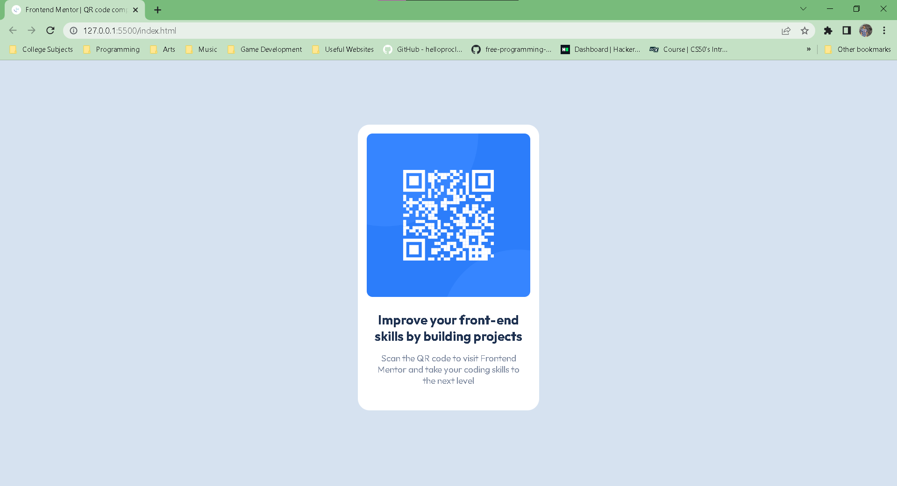

# Frontend Mentor - QR code component solution

This is a solution to the [QR code component challenge on Frontend Mentor](https://www.frontendmentor.io/challenges/qr-code-component-iux_sIO_H). Frontend Mentor challenges help you improve your coding skills by building realistic projects.

## Table of contents

- [Overview](#overview)
  - [Screenshot](#screenshot)
  - [Links](#links)
- [My process](#my-process)
  - [Built with](#built-with)
  - [What I learned](#what-i-learned)
  - [Continued development](#continued-development)
  - [Useful resources](#useful-resources)
- [Author](#author)

## Overview

### Screenshot



### Links

- Solution URL: [https://www.frontendmentor.io/solutions/qr-code-component-solution-using-css-flexbox-jETDB38L3Y](https://www.frontendmentor.io/solutions/qr-code-component-solution-using-css-flexbox-jETDB38L3Y)
- Live Site URL: [https://lemon1903.github.io/QR-Code-Component-Solution/](https://lemon1903.github.io/QR-Code-Component-Solution/)

## My process

### Built with

- HTML
- CSS Flexbox

### What I learned

Learned more basic CSS during this challenge and here are the notable ones:

- Using color variables

```css
:root {
  --white: hsl(0, 0%, 100%);
  --light-gray: hsl(212, 45%, 89%);
  --grayish-blue: hsl(220, 15%, 55%);
  --dark-blue: hsl(218, 44%, 22%);
}
```

- Using `@font-face` for font-style

```css
@font-face {
  font-family: Outfit-Regular;
  src: url(fonts/Outfit/static/Outfit-Regular.ttf);
}
```

- Using Flexbox for items alignment

```css
body {
  display: flex;
  justify-content: center;
  align-items: center;
}

.container {
  display: flex;
  flex-direction: column;
}
```

### Continued development

With being new to HTML and CSS, I want to continue learning more on its basics like the HTML elements and tags, and more CSS properties and how to use them. More specifically are:

- Using fonts in CSS
- Using different displays in CSS
- Efficient class definition and using utility classes in CSS
- Centering the contents inside a div or body

### Useful resources

- [CSS Reference](https://www.w3schools.com/cssref/index.php) - This helped me easily lookup some CSS properties I don't actually know yet.
- [CSS Flexbox](https://dhis2-app-course.ifi.uio.no/learn/essential-front-end/css/flex/) - This helped me know more about CSS Flexbox and how to use them.
- [Using Font in CSS](https://www.geeksforgeeks.org/how-to-include-a-font-ttf-using-css/) - This helped me how to use fonts in CSS initially. Still vague and wants to know better way to use fonts but this is a good start.

## Author

- Frontend Mentor - [@Lemon1903](https://www.frontendmentor.io/profile/Lemon1903)
