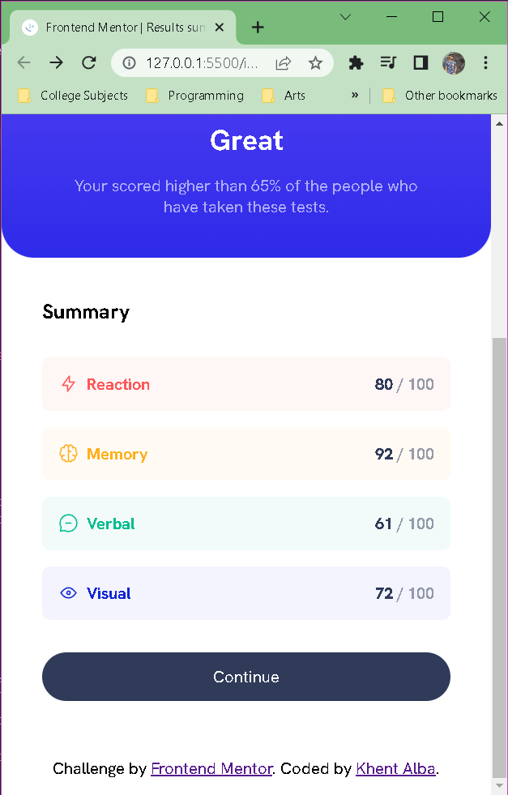

# Frontend Mentor - Results summary component solution

This is a solution to the [Results summary component challenge on Frontend Mentor](https://www.frontendmentor.io/challenges/results-summary-component-CE_K6s0maV). Frontend Mentor challenges help you improve your coding skills by building realistic projects.

## Table of contents

- [Overview](#overview)
  - [The challenge](#the-challenge)
  - [Screenshot](#screenshot)
  - [Links](#links)
- [My process](#my-process)
  - [Built with](#built-with)
  - [What I learned](#what-i-learned)
  - [Continued development](#continued-development)
  - [Useful resources](#useful-resources)
- [Author](#author)
- [Acknowledgments](#acknowledgments)

## Overview

### The challenge

Users should be able to:

- View the optimal layout for the interface depending on their device's screen size
- See hover and focus states for all interactive elements on the page

### Screenshot

**- Desktop Version**


**- Mobile Version**




### Links

- Solution URL: [Add solution URL here](https://your-solution-url.com)
- Live Site URL: [Add live site URL here](https://your-live-site-url.com)

## My process

### Built with

- Semantic HTML
- CSS custom properties
- CSS Flexbox and Grid
- Mobile-first workflow

### What I learned

I learned a lot on bringing designs to life using HTML and CSS. Here are the notable ones:

- I have learned some tips such as analyzing the design thoroughly before coding it and with that I can breakdown the design on what layouts to use and similar components.
- Resetting the element properties helps me to focus more on styling them from scratch.
- Understood CSS units and their proper usage.
- Understand more on custom properties to easily change and reuse it.

```css
:root {
  --primary-light-red: 0, 100%, 67%;
  --primary-orangey-yellow: 39, 100%, 56%;
  --primary-green-teal: 166, 100%, 37%;
  --primary-cobalt-blue: 234, 85%, 45%;
  ...
  --gradient-primary: linear-gradient(var(--light-slate-blue), var(--light-royal-blue));
  --gradient-to-transparent: linear-gradient(var(--violet-blue), var(--persian-blue));

  --fw-regular: 500;
  --fw-bold: 700;
  --fw-black: 800;

  --fs-500: 1.25rem;
  --fs-700: 1.75rem;
  --fs-800: 2rem;
  --fs-900: 5rem;
}
```

- Understand basics of media query. For example the look in desktop views:

```css
@media (min-width: 600px) {
  body {
    min-height: 100vh;
    display: flex;
    flex-direction: column;
    align-items: center;
    justify-content: center;
  }
}
```

- Using inheritance for parent and children properties.

```css
.results-summary {
  --border-radius: 2em;
  --padding: 2.5em;
}

.results {
  border-radius: var(--border-radius);
}
```

### Continued development

- I want to focus more on using proper semantic HTML tags.
- Getting more comfortable on structuring HTML and efficient CSS code.
- Dive deep on HTML tags, proper CSS coding and its properties, and Javascript fundamentals.

### Useful resources

- [HTML Elements Reference](https://www.w3schools.com/tags/) - Helps me to lookup for html elements.
- [HTML Semantics](https://laylacodes.hashnode.dev/what-is-semantic-html) - This helps me understand more about sematic HTML and why to use them instead of divs.

## Author

- Frontend Mentor - [@Lemon1903](https://www.frontendmentor.io/profile/Lemon1903)

## Acknowledgments

I want to thank Kevin Powell's youtube channel as it helped me learn more on CSS. Check out his channel to learn more not only about CSS, but more on Web Development! Click [here](https://www.youtube.com/@KevinPowell) to redirect to his youtube channel.
